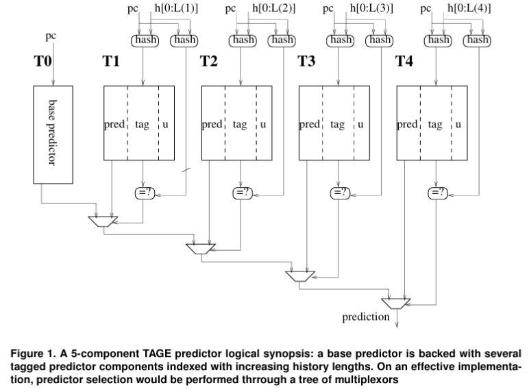

# Custom TAGE Branch Predictor

This project implements a custom TAGE (TAgged GEometric history length) branch predictor, a state-of-the-art dynamic branch predictor known for high accuracy in modern processors.

## Introduction

Branch prediction improves instruction-level parallelism by guessing the outcome of conditional branches to reduce stalls. TAGE surpasses classic predictors such as Gshare and Tournament by exploiting multiple history lengths for more robust predictions across diverse branch patterns.

## TAGE Predictor Overview

- **Geometric History Lengths:** Multiple tables indexed with global histories of geometrically increasing length capture short- and long-range correlations.
- **Tagging:** Entries contain tags derived from PC and history hashes to reduce aliasing.
- **Usefulness Counters:** Track entry usefulness to adaptively disable or replace stale entries.

## Implementation Details

| Component           | Details                                                   |
|---------------------|-----------------------------------------------------------|
| Total Tables        | 5 (T0 base, T1–T4 tagged)                                |
| Table Indexing      | T0 indexed by 11 PC bits; T1-T4 by PC + folded histories (8, 16, 32, 64 bits) |
| Tag Sizes           | 9 bits for T1-T4                                          |
| Counters            | 3-bit saturating counters for predictions; 2-bit usefulness counters |
| Global History      | 64-bit register                                          |
| Reset Counter       | Resets usefulness counters every 2,097,152 predictions   |

### Prediction Logic

- Query tagged tables from longest to shortest history.
- Use longest matching tagged table prediction, else base table T0.
- If provider entry is weak and fresh, use alternate prediction (next best match).
- Update counters on actual branch outcomes.
- Allocate new entries on misprediction if possible, age out old entries.

### Usefulness Counter Reset

- Halfway reset clears MSB of usefulness counters.
- Full reset clears LSB to avoid saturation and encourage adaptability.

## Design Benefits

- Captures diverse branch behaviors with different history lengths.
- Reduces aliasing via tagging.
- Dynamic learning with usefulness counters.
- Periodic resets maintain adaptivity.
- Base predictor acts as fallback.

## Comparison of Predictors (Misprediction Rates in %)

| S.No | Trace          | Gshare | Tournament | Custom TAGE |
|-------|----------------|--------|------------|-------------|
| 1     | U1Blender.bz2  | 33.654 | 29.396     | 21.108      |
| 2     | U2Leela.bz2    | 101.729| 96.506     | 77.781      |
| 3     | U3GCC.bz2      | 19.608 | 15.415     | 5.674       |
| 4     | U4Cam4.bz2     | 10.030 | 6.416      | 6.075       |

## Budget Allocation (Bits Used)

| Component          | Entries     | Bits per Entry                     | Total Bits     | Description                          |
|--------------------|-------------|----------------------------------|----------------|------------------------------------|
| Base Table T0      | 2112048     | 3 (saturating counters)           | 6,144          | Simple predictor counters           |
| Tagged Table T1-T4 | 2101024 each| 3-bit predictor + 9-bit tag + 2-bit usefulness = 14 bits | 14,336 each   | Tagged predictor with usefulness    |
| Global History Reg | 1           | 64 bits                         | 64             | 64-bit global history register      |
| Reset Counter      | 1           | 21 bits                         | 21             | Tracks training iterations          |

**Total Storage:** 61,529 bits (~7.56 KB)

## References

1. André Seznec. Analysis of the O-GEometric History Length branch predictor. IRISA-INRIA-HIPEAC, Rennes, France.  
2. The Alpha 21264 Microprocessor: High-performance features and speculative execution.  
3. André Seznec, Pierre Michaud. A case for partially TAgged GEometric history length branch prediction. IRISA-INRIA-HIPEAC, Rennes, France.  

